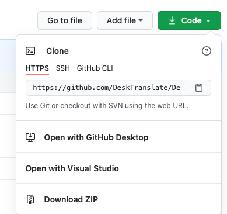

# Welcome to DeskTranslate-Mac!


## Description
This version is for macOS users!

## Links
|:information_source:  | [Our Website](https://desktranslate.github.io/DeskTranslate/)   |
|---------------|:------------------------|

|:information_source:  | [User Guide](https://desktranslate.github.io/DeskTranslate/UserGuide.html)   |
|---------------|:------------------------|

|:information_source:  | [Devpost Link](https://devpost.com/software/desktranslate)   |
|---------------|:------------------------|


## Quick Start

### Using our installer

Releases of DeskTranslate can be found [here](https://github.com/DeskTranslate/DeskTranslate-Mac/releases/tag/v1.0).  

### Downloading from our repo [for developers]



1. To get started, download DeskTranslate at our main repo by clicking Code -> Download ZIP.

2. Ensure Python is installed on your computer.

3. Using terminal, go to the directory where the repo is downloaded to. 

4. Download the libraries required:  
`pip install -r requirements.txt`

5. Install Tesseract: 
`brew install tesseract` and `brew install tesseract-lang`

> Note: The script searches for version `5.3.2` of tesseract
> If required, change the version number in `helpers/screen_reader.py`
```python
#helpers/screen_reader.py
pytesseract.pytesseract.tesseract_cmd = r'/opt/homebrew/Cellar/tesseract/5.3.2/bin/tesseract'
```

6. Next, enter the following command to start the program:
`python main.py`


